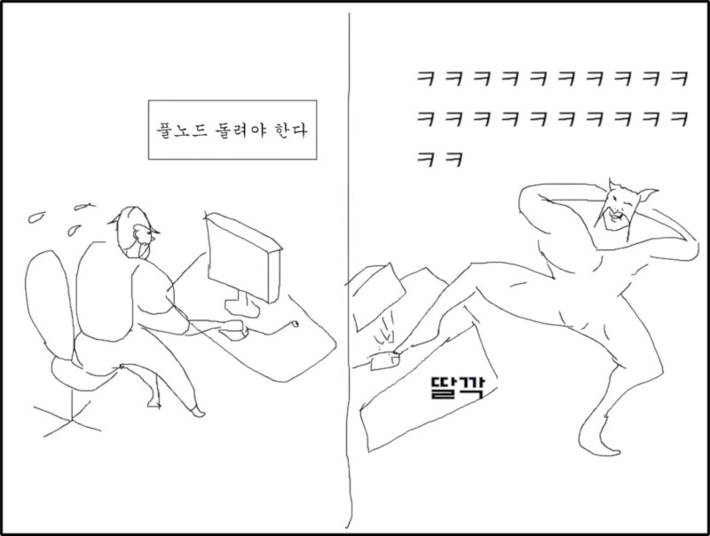

# 노드딸깍이(Nodeddkkee)

## 소개


- 노드딸깍이(Nodeddkkee)는 비트코인 코어 노드를 쉽게 설치하고 설정할 수 있는 자동화 스크립트입니다. 
- 풀노드를 운영하면 비트코인 타임체인을 완전히 검증하고 저장할 수 있습니다. 
- 스패로우를 활용하면 코어 및 일렉트라에 직접 로컬 연결할 수 있습니다. 
- 테일스케일을 설치하면 와치온리 모바일 지갑을 내 노드와 연동할 수 있습니다.

## 시작하기

설치방법 영상: [https://youtu.be/OAzbm4wiswQ](https://youtu.be/OAzbm4wiswQ)

### 필수 조건
- x86 기반의 미니PC: 오드로이드H4 기기에서 테스트
- 리눅스 운영체제 (Ubuntu/Debian 계열 권장): 우분투22.04 서버 버전으로 테스트
- 최소 1TB 이상의 저장 공간
- 최소 8GB RAM
- 안정적인 인터넷 연결
- sudo 권한이 있는 사용자 계정

### 설치 방법

#### 1. 리눅스가 설치되어 있는 기기에 접속할 별도 컴퓨터를 사용하거나, 리눅스 설치되어 있는 기기에 키보드 연결합니다.

- 리눅스 기기에 별도로 연결하려면 ssh 방식으로 접속해야 합니다.
- 윈도우 기준으로 터미널을 찾아 실행합니다.
- 깜빡이는 커서에 ssh 연결 명령어를 입력해야 합니다.
- 아이디가 mybtc이고 접속 주소가 192.168.1.3 이라고 가정하면, 아래와 같은 명령어를 입력합니다.
- 패스워드 입력하라고 나오면 설정된 패스워드를 오타없이 입력합니다.

```bash
ssh mybtc@192.168.1.3
```

#### 2. 리눅스에 ssh로 접속했다면 이제 아래 스크립트를 복사한 후에 터미널 창에 붙여 넣고 엔터를 칩니다.

- 모든 파일은 한꺼번에 다운로드 받을 수 있는 명령어입니다. 
- 동작 절차는 모두 쉘스크립트로 작성되어 있으므로 별도의 설치 프로그램 없이 바로 실행할 수 있습니다.

```bash
wget https://github.com/my3rdstory/nodeddkkee/raw/refs/heads/master/1_core.sh \
     https://github.com/my3rdstory/nodeddkkee/raw/refs/heads/master/2_electrs.sh \
     https://github.com/my3rdstory/nodeddkkee/raw/refs/heads/master/3_ts.sh \
     https://github.com/my3rdstory/nodeddkkee/raw/refs/heads/master/del.sh
```

#### 3. 다운로드 후 아래 명령어로 필요한 프로그램에 맞춰 실행합니다. 

- 실행 중에 계속 진행을 위해 물어보는 경우가 있습니다. 대부분 Y, y, yes 등을 입력하면 계속 진행할 수 있습니다.
- 따로 악성 프로그램을 설치하지 않으니 그냥 설치해도 됩니다. 소스를 열어 봐도 별거 없을 거에요.

**(1) 비트코인 코어 설치**

비트코인 코어와 스패로우를 연동하면 코어만으로도 트랜잭션을 브로드캐스팅 할 수 있습니다. 가장 편리하면서도 깔끔한 방법입니다. 컴팩트하게 풀노드를 운영하고 싶으면 코어만 설치해도 됩니다. 코어에 할당한 포트는 8332입니다.

```bash
sudo bash 1_core.sh
```

**(2) 일렉트라 서버 설치**

비트코인 코어와 연동해서 사용할 수 있는 서버입니다. 스패로우의 경우 코어 이외에 일렉트사 서버를 연동할 수 있습니다. 토르나 테일스케일과 함께 사용하면 모바일 앱에도 연동할 수 있습니다. 일렉트라에 할당한 포트는 50001입니다.

```bash
sudo bash 2_electrs.sh
```

**(3) 테일스케일 설치**

테일스케일에서 제공하는 VPN을 활용할 수 있습니다. 테일스케일 회원가입이 필요합니다. 모바일 앱의 경우 테일스케일의 모바일 앱을 먼저 실행하여 VPN 모드 상에서 연동해야 합니다.

```bash
sudo bash 3_ts.sh
```


## 기능
- Bitcoin Core v28.1 자동 설치 및 설정: 버전을 바꾸려면 1_core.sh 파일에서 버전 변경 필요
- RPC 인터페이스 자동 구성
- 시스템 서비스로 자동 실행 설정
- 타임체인 데이터 검증 및 저장
- 테일스케일 연동 및 연결 정보 json 파일로 저장

## 사용 방법

### 1. 설치가 완료된 후 다음 명령어로 비트코인 노드 상태를 확인할 수 있습니다.

- 윈도우 터미널 화면 분할 기능을 이용해서 2개 이상의 현황을 살펴볼 수도 있습니다.
- 윈도우 파워쉘 기준으로 alt+shift+d 단축키 누르면 창을 2개로 분리할 수 있습니다.
- 각 창에 하나는 코어 블록 다운로드 확인 명령어를, 다른 창에는 풀크럼 로그 실시간 확인 명령어를 입력하면 2개의 설치 및 동기화 현황을 실시간으로 지켜볼 수 있습니다.

```bash
# 타임체인 정보 확인
bitcoin-cli getblockchaininfo

# 코어 피어 연결 정보 확인
bitcoin-cli getpeerinfo

# 코어 블록 다운로드 로그 확인
tail -f ~/.bitcoin/debug.log

# 일렉트라 로그 확인
sudo journalctl -u electrs -f

# 일렉트라 최근 5분 로그 확인
sudo journalctl -u electrs --since="-5 minutes"

# 일렉트라 실행 여부 확인
ps aux | grep electrs

# 테일스케일 정보 확인
nano ts_info.json

# 코어 인바운드/아웃바운드 현황 확인
bitcoin-cli getpeerinfo | jq '{inbound:map(select(.inbound==true)) | length, outbound:map(select(.inbound==false)) | length}'

# 노드의 기기 현황 확인 - glances 사용
glances

# 노드의 기기 현황 확인 - htop 사용
htop

```
### 2. 설치 실패했다면

- 실행 중 멈췄다면 ctrl+c 키를 눌러 설치 프로세스를 종료한 후 다시 설치 스크립트를 실행해 보세요.
- 재설치를 위해 프로세스를 한번에 멈추려면 del.sh 파일을 실행하세요.
- 그래도 안된다면 에러 메시지 보면서 스스로 대응하셔야 합니다.

## 주의

- 저는 코딩 못합니다. 커서 조져서 대충 만든거에요. 
- 제 오드로이드 H4 기기에서만 테스트했습니다. 다른 기기에서 동작을 보장하지 않습니다. 
- 수정 요청하셔도 제가 대응하지 못 할 수 있습니다. 필요한 부분은 포크해서 마음껏 수정해서 사용하세요.

## 라이센스
MIT

## 연락처

- 작성자: DedSec
- 엑스: https://x.com/_orangepillkr
- 유튜브: https://www.youtube.com/@orangepillkr/
- 스페셜땡쓰: 
   
   - 셀프카스타드님: https://x.com/self_custard   
   - ⚡️돌돌₿⚡️ https://x.com/s01ist_btc
- 참고문헌: https://florentine-porkpie-563.notion.site/2e905cab90ae4a979711ec40bbb85d64?v=7c329be91bd44a03928fcfa3ed4c3fe4   
